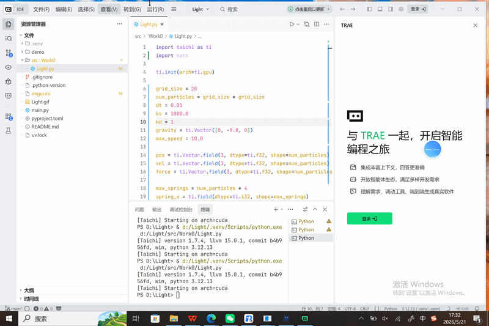
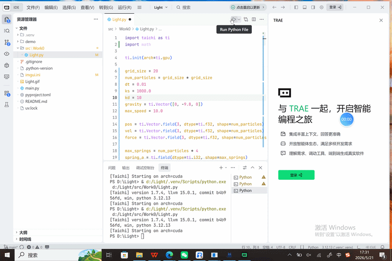
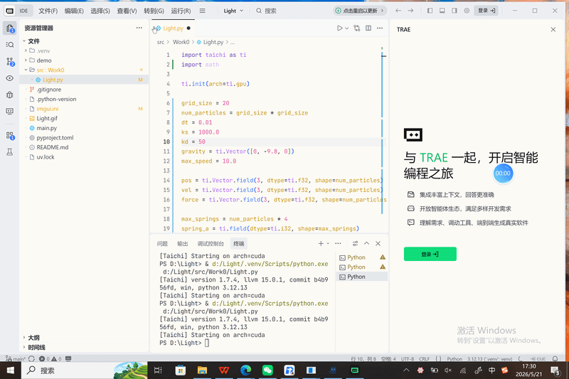

# 弹簧模型 效果展示

-占博文 202411081043 人工智能

## 效果演示

### 阻尼为1时

### 阻尼为10时

### 阻尼为50时

## 一、项目简介
本项目为计算机图形学物理仿真核心实验，基于 Python 手写实现经典弹簧-质点系统（Mass-Spring System）。通过构建质点网格与弹簧约束，模拟柔性物体的形变、振动、回弹与阻尼衰减物理过程，实现布料、柔性平面的动态仿真效果。本实验完整还原图形学软物体物理模拟底层逻辑，是游戏布料模拟、柔体动力学、动态特效的基础核心算法。
## 二、项目目录结构
Spring/
├── src/Work0/                # 核心实验源码目录
├── main.py                   # 程序入口、物理仿真主函数
├── 1-ezgif.com-video-to-gif-converter.gif   # 阻尼=1 演示效果
├── 10-ezgif.com-video-to-gif-converter.gif  # 阻尼=10 演示效果
├── 50-ezgif.com-video-to-gif-converter.gif  # 阻尼=50 演示效果
├── imgui.ini                 # 界面布局配置
├── .gitignore                # 忽略虚拟环境、缓存文件
├── .python-version           # Python 版本锁定
├── pyproject.toml            # 项目依赖配置
├── uv.lock                   # 依赖版本锁定文件
└── README.md                 # 项目说明文档
## 三、运行环境与依赖
- Python 版本：3.10+
- 环境说明：本地虚拟环境 .venv 已忽略，不提交仓库
- 依赖管理：支持 uv / pip 安装依赖
## 四、运行指令
项目根目录直接运行：
python main.py
## 五、核心算法原理
1. 弹簧质点系统概述
弹簧质点系统是计算机图形学中最经典的柔体物理仿真模型。将连续柔性物体离散为大量质量质点，质点之间通过虚拟弹簧连接，依靠胡克定律、阻尼力学、速度迭代，模拟物体拉伸、抖动、松弛、静止的全过程。
2. 核心力学公式
（1）胡克弹簧弹力公式
$$F_{spring} = k \cdot (L - L_0)$$
$$k$$ 为弹簧刚度系数，$$L$$ 为当前长度，$$L_0$$ 为原始静止长度。拉伸产生拉力、压缩产生推力，保证网格结构稳定。
（2）阻尼衰减公式
$$F_{damp} = -d \cdot v$$
$$d$$ 为阻尼系数，$$v$$ 为质点速度。阻尼力与速度反向，消耗振动能量，让物体最终趋于静止。
（3）牛顿运动迭代
$$a = F_{total} / m,\quad v = v + a\cdot\Delta t,\quad x = x + v\cdot\Delta t$$
通过加速度、速度、位置逐帧迭代，实现连续物理运动模拟。
3. 不同阻尼效果对比原理
- 阻尼 = 1（弱阻尼）：能量损耗极小，质点持续高频振动、回弹剧烈，长时间难以静止，画面抖动效果强烈。
- 阻尼 = 10（中等阻尼）：振动衰减适中，回弹自然，符合常规柔性物体运动效果。
- 阻尼 = 50（强阻尼）：能量快速消耗，几乎无振动回弹，物体受力后直接缓慢归位，运动僵硬、无抖动。
4. 仿真流程
1. 初始化质点网格结构与弹簧约束关系；
2. 逐帧计算每根弹簧弹力与阻尼力；
3. 叠加重力、约束力求解质点合外力；
4. 更新质点加速度、速度、位置；
5. 刷新网格渲染，实现动态柔性运动效果。
## 六、项目核心功能
- 构建二维网格弹簧质点拓扑结构
- 基于胡克定律实现标准弹簧弹力模拟
- 支持自定义阻尼系数，实现不同物理表现
- 真实模拟柔性物体振动、回弹、衰减、静止全过程
- 纯物理算法实现，参数可控、原理透明
## 七、项目特点
- 物理真实：严格遵循经典力学模型，动态效果贴合现实柔体运动
- 参数直观：三组阻尼对照实验，清晰体现阻尼力学特性
- 教学性强：完美覆盖图形学柔体仿真核心知识点
- 拓展性高：可拓展布料碰撞、风力扰动、破碎模拟等高级特效

## 项目说明
- 项目核心代码存放于 src/ 目录
- 本地虚拟环境 .venv 已忽略
